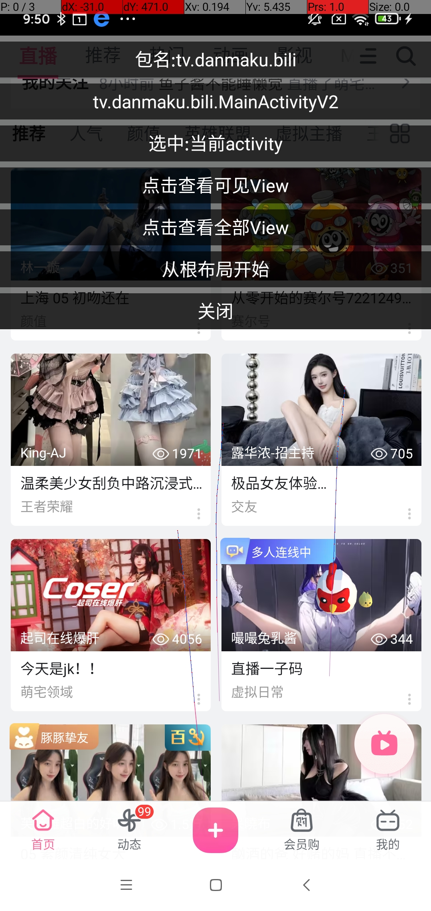
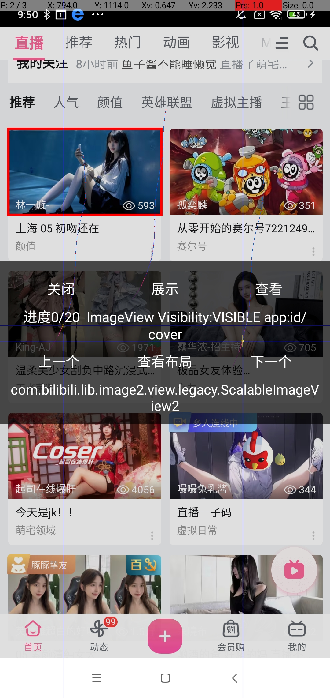
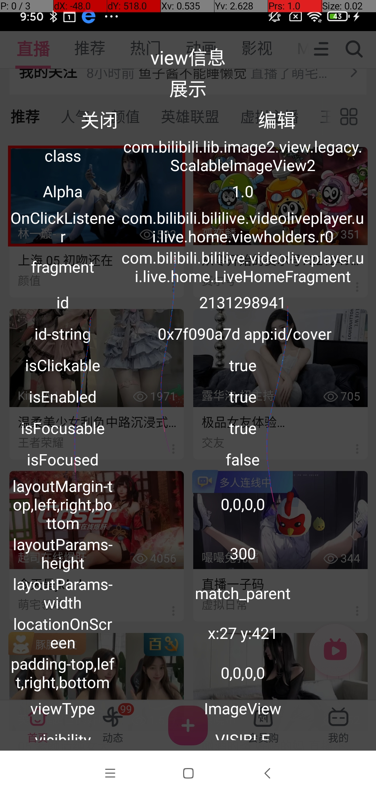

## android ui查看工具

可以在手机查看ui布局

分为aar版本和xposed版本

### aar版本

或者采取jitpack仓库依赖

```groovy
    allprojects {
    repositories {
        maven { url 'https://www.jitpack.io' }
    }
}
dependencies {
       //若只想在测试环境使用 使用debugImplementation依赖
    implementation 'com.github.ming123aaa.android_viewTools:activityUIHook-app:1.2.3'  
      
}
```


若需要禁用自动初始化,可通过AndroidManifest.xml添加以下代码
```xml

<application>
        <meta-data
            android:name="activityHook_enable"
            android:value="false" />

</application>
```

依赖完成后主进程自动进行初始化操作, 如果需要手动初始化:
```java
UiHookManager.getInstance().init(this);
```


### xposed版本
可生成xposed模块,配合xposed使用这样就可以查看其它app的ui

### 效果展示
点击小鸡后出现:



点击查看可见View,可通过点击屏幕方式选中View



点查看，可以查看当前View的一些信息




## 项目说明

app 运行的是xposed的版本

Xposed_main是核心模块 主要功能都在该模块

noXposed_main 是aar版本 使用noxp_uihook模块进行运行测试

### 打包aar

需要打 Xposed_main 、noXposed_main 两模块的aar

运行gradle插件的publish 生成的aar会在repositories文件下

## 项目代码修改时注意点

### xp模块资源请使用 XModuleResources加载

加载xp模块里面的资源需要使用 XModuleResources

### 自定义View及第三方View不要写在xml里面

ui创建使用的是宿主app的classLoader,与模块的classLoader不同，所有即使包名相同强转的话依然会报错。建议动态加载。

### View使用tag来代替id

部分app使用的换肤框架可能会View创建的使用改id,导致模块findViewById找不到View的情况。所有使用findViewWithTag来代替。


